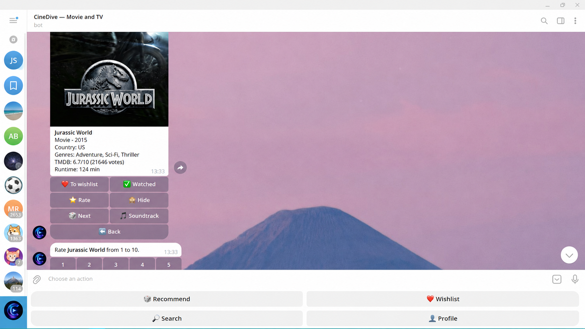

# CineDive Telegram Bot

**@cinedivebot** is a Telegram bot for movie and TV show discovery, personal watchlists, ratings, and recommendation flows powered by TMDB data.

Search for films and series, save titles, mark them as watched, rate them, and get recommendations based on your favorite genres and current mood.

## What is it?

CineDive Bot is a modular Telegram bot that helps users discover what to watch next directly inside Telegram.

It combines TMDB search, saved media cards, wishlist management, watched history, ratings, temporary mood preferences, and soundtrack links in one chat-based interface.

## Example Use Case

Choosing something to watch tonight:

- search for a movie or TV show;
- open a clean media card with poster, overview, rating, and metadata;
- save interesting titles to a wishlist;
- mark watched titles and rate them from 1 to 10;
- select your current mood;
- receive simple personalized recommendations.

## Features

- TMDB-backed movie and TV search
- Media cards with posters, metadata, overview, and action buttons
- Wishlist add, list, open, and remove flows
- Watched status tracking
- 1-10 user rating flow
- Favorite-genre onboarding
- 24-hour mood presets for recommendation context
- Simple non-ML recommendations from saved media and preferences
- Soundtrack discovery links with Deezer direct matches where available
- English and Russian Telegram UI localization
- Inline Telegram controls and clean button-based navigation
- Production webhook mode and local polling mode

## Why this demo matters

This repository demonstrates my ability to design and build Telegram bots with structured backend architecture, external API integrations, persistent user state, localized UX, and deploy-ready infrastructure.

I can build similar bots for:

- media catalogs and recommendation systems;
- personal assistants and productivity workflows;
- booking and scheduling;
- CRM and customer support automation;
- subscription-based services;
- community engagement tools;
- internal company tools;
- Telegram mini-app integrations.

## Tech Stack

- Python
- aiogram 3
- Telegram Bot API
- TMDB API
- PostgreSQL
- SQLAlchemy 2 async
- Alembic migrations
- Docker
- GitHub Actions
- Linux/VDS deployment

## Architecture Highlights

- Handlers are focused on Telegram UX and conversation flows
- Services contain business logic and external API integrations
- Repositories isolate database access
- SQLAlchemy models define persistent entities
- Locale files keep UI text separate from bot logic
- Webhook mode includes health checks and Telegram secret validation

## Custom Development

Need a custom Telegram bot for your business, product, or community?

I can help with:

- bot architecture and backend development;
- Telegram Bot API integration;
- database design;
- third-party API integrations;
- Docker setup and VPS/VDS deployment;
- admin panels or custom workflows;
- business logic for your specific use case.

## Contact

- GitHub: https://github.com/mavarok13
- Email: makarovsam13@gmail.com
- Telegram: @makarovsam
